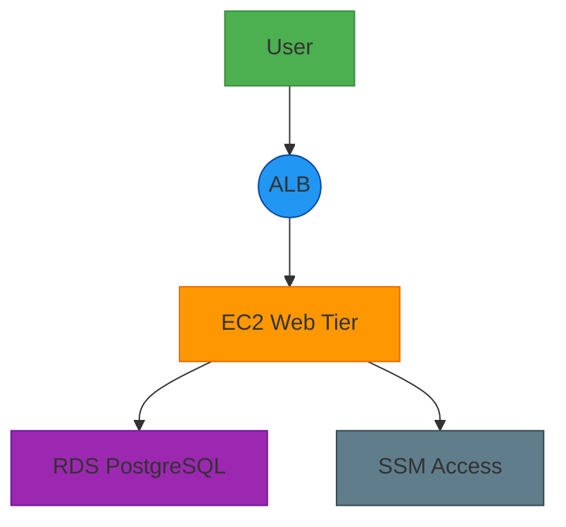
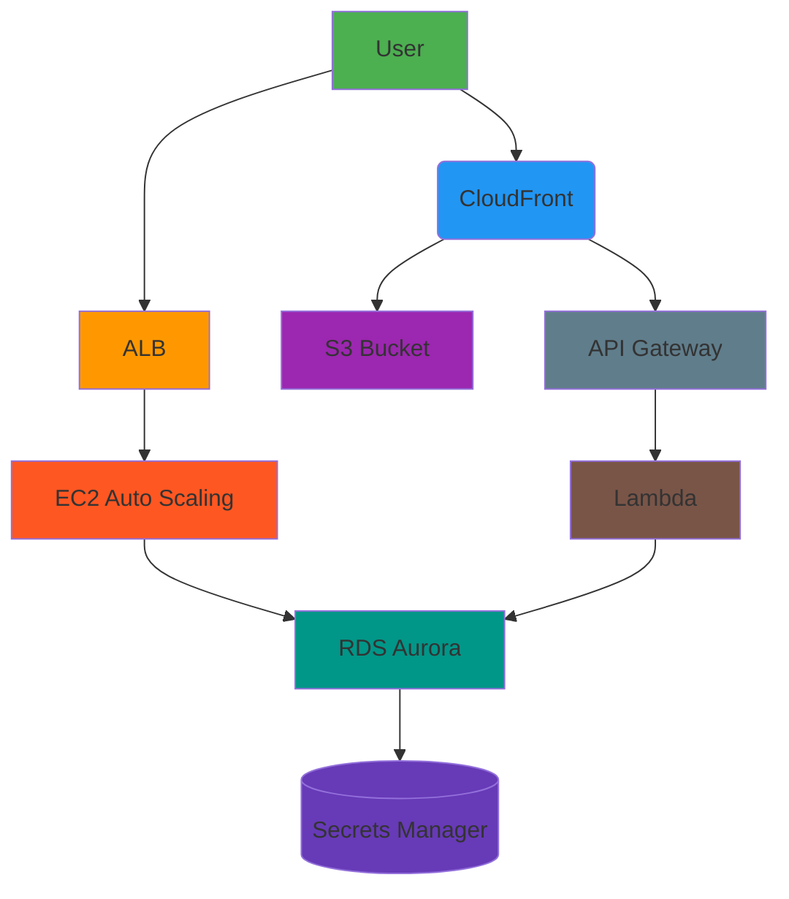
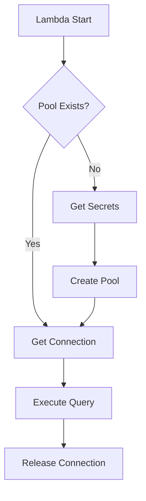

# 🚀 AWS 3-Tier Architecture Infra Challenge | Terraform Edition | Simple Web Server with AGS

Simple three-tier architecture using AWS Free Tier resources that's both *scalable* and *secure* 


## Architecture Overview
```
[Internet]
  |
[Application Load Balancer]
  |
[Auto Scaling Group] - Web Tier (EC2 instances)
  |
[Application Tier] - (Future microservices)
  |
[Database Tier] - RDS PostgreSQL
```

## Components
- **Network**: VPC with public/private subnets, NAT Gateway
- **Web Tier**: Auto-scaled EC2 instances behind ALB
- **Data Tier**: Managed PostgreSQL with Secrets Manager
- **Security**: IAM roles, Security Groups, encrypted storage

🛠️ Getting Started

Pre-reqs:
AWS account (free tier)
Terraform v1.3+
Coffee ☕ 

## Initialize Terraform:
```bash
terraform init
terraform plan # Please always check the plan!
terraform apply
```

## Core Infrastructure Components

### 🛠️ Foundation Layer
**VPC Network** (`devops-infra-web-test-vpc`)
- Multi-AZ architecture in eu-west-3
- Public subnets (10.0.1.0/24, 10.0.2.0/24)   - Web Tier
- Private subnets (10.0.3.0/24, 10.0.4.0/24)  - App Tier
- Isolated subnets (10.0.5.0/24, 10.0.6.0/24) - DB Tier
- NAT Gateway + Internet Gateway

### Implementation 1: EC2 Web Apache Server Tier

[User] -> [ALB (devops-infra-web-test-alb)]
-> [EC2 Auto Scaling Group (t2.micro with for_each loop for multiAZ)]
-> [RDS Aurora PostgreSQL (devops-infra-web-test-RDS-AURORA-POSTGRES-DB)]

**Features**:
- Auto-healing web servers
- SSM access only (no SSH)
- Encrypted RDS with Secrets Manager
- Cost tracking tags (should add more)

## Architecture Snapshot FOR Web Apache Server



## Implementation 2: Serverless Tier

[User] -> [CloudFront]
-> [S3 (React App)]
-> [API Gateway]
-> [Lambda]
-> [Same RDS Aurora]

**Features**:
- Global content delivery
- JWT auth via Cognito
- Auto-scaling Lambda functions
- Shared VPC infrastructure

## Serveless Architecture


## Lambda Optimization

**Connection Handling**:


## 🚀 Deployment

Initialize backend:
```bash
terraform apply -target=module.tf_state_bucket
terraform apply -target=aws_dynamodb_table.terraform_lock

## deploy

terraform init
terraform apply
```

## Cool Features
Auto-Healing Web Servers 🤖 - Auto Scaling groups replaces unhealthy instances

Encrypted RDS 🔐 - Secure data

Cost Tracking 💸 - Tags help track spend

Repo Tagging 🏷️ - Most resources links back here

Best AWS TF modules - achieve a modular core structure for any AWS architecture


## Why AntonBabenko's Modules?
For example, the AWS RDS Aurora Module has the best features:

Zero-downtime modifications
Automated read-replica scaling
Cross-region replication
Serverless v1, v2 configurations
Custom monitoring metrics
IAM database authentication

## Security highlights

State Management: Encrypted S3 bucket + DynamoDB locking
Network Security: VPC flow logs (enable in variables)
Data Protection: RDS encryption at rest/in-transit
Access Control: SSM-based EC2 access (way safer than open ports and use SSH)

## Next Steps
- Add monitoring (CloudWatch, OpenTelemetry with Grafana LGTM stack)
- Implement CI/CD pipeline (Github actions, Auto-deploy on Git push)
- Add a better application tier (Lambda/ECS, Implement blue/green deployment for Lambda)
- Enable VPC Flow Logs
- Better availability cross regions
- Configure backup/DR strategy
- Implement WAF for ALB
- Enable RDS Performance Insights (monitoring tools like PGAnalyze)
- Add Terraform state validation
- Cost Budgets (prevent surprise bills)

**Important**: This is a minimal setup - production environments require additional security, AWS SSO,  hardening and monitoring, especially might require AWS EKS for specific cloud computing needs.
